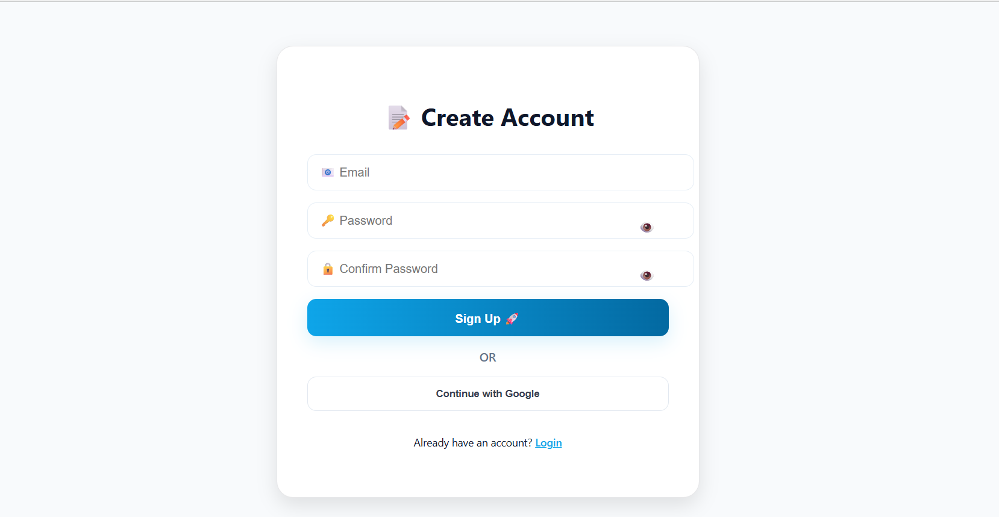
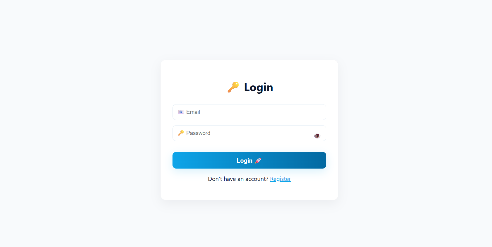
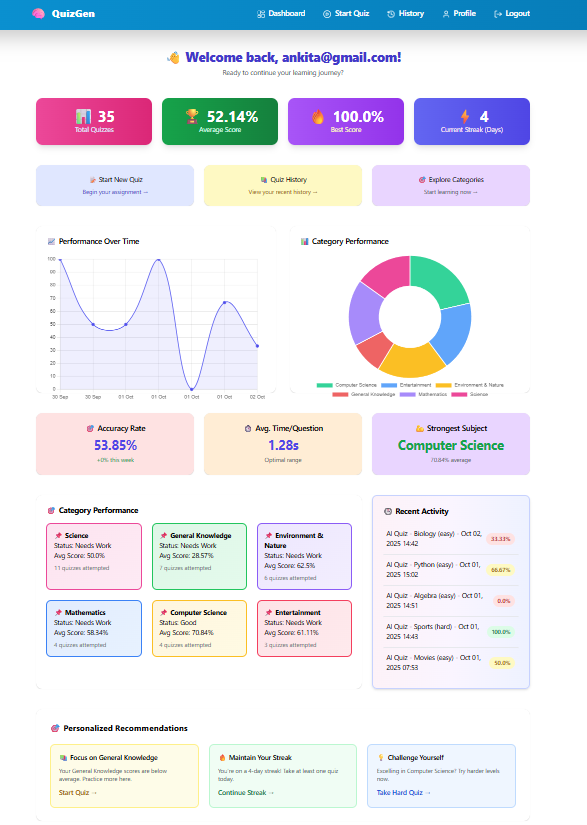
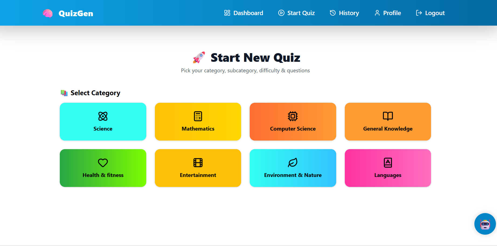
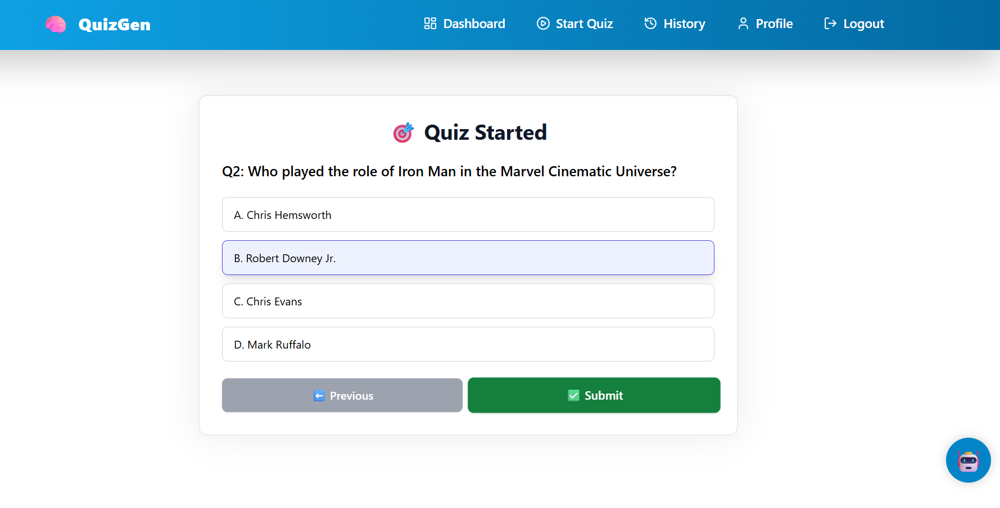
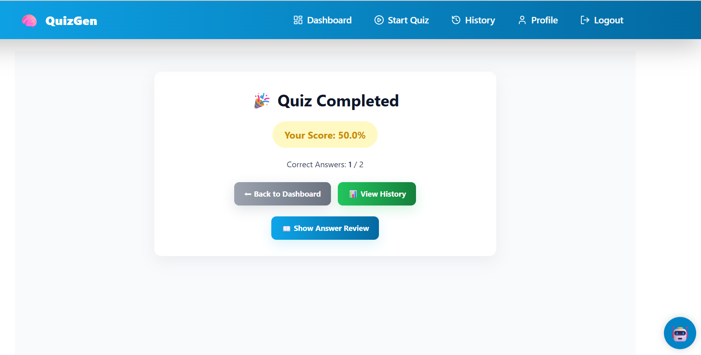
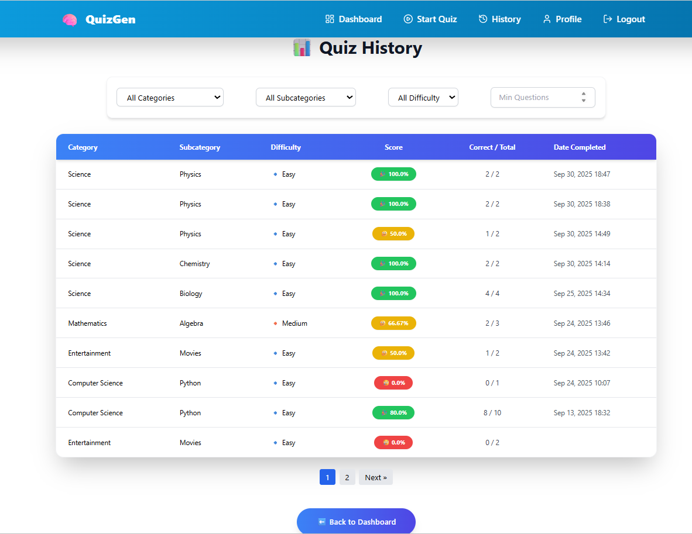
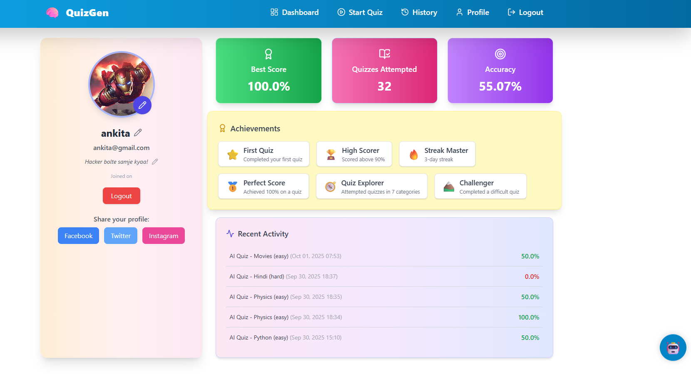

** QuizGen - AI Powered Quiz Generating Application**

## Project Overview
**QuizGen** is a web-based application that allows users to dynamically generate quizzes using AI. It provides personalized learning experiences, performance tracking, and interactive dashboards.

- **Personalized Quizzes:** Select category, subcategory, difficulty level, and number of questions.
- **Performance Tracking:** Review results, track history, and analyze performance with charts.
- **Profile Management:** Upload profile picture, update username, add bio.
- **Chatbot Assistant:** Real-time guidance and query resolution.

## Technology Stack
- **Backend:** Django (Python)
- **Frontend:** HTML, CSS, JavaScript, Tailwind CSS
- **Database:** SQLite
- **API Integration:** AI-powered quiz generation via API
- **Other Tools:** Django ORM, Authentication, Chatbot framework, Bootstrap/Tailwind

## Features
1. User Authentication (Login, Registration, Logout)
2. Dashboard showing key stats (total quizzes, best score, streaks)
3. AI-powered quiz generation with dynamic MCQs
4. Result and history pages with filters
5. Profile management (username, bio, picture)
6. Chatbot assistant for real-time help

## Screenshots

### 1. Sign Up Page

### 2. Login

### 3. Dashboard Page

### 4. Category Page

### 5. Quiz Page

### 6. Result Page

### 7. History Page

### 8. Profile Page

